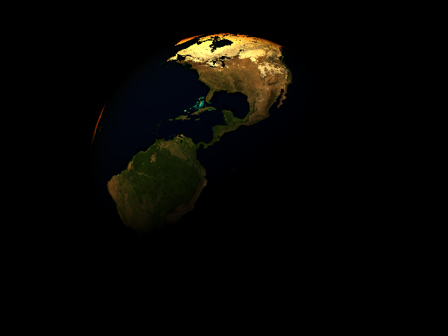

# Atmospheric Scattering

Work in progress

# Work log

Chronological

1. First useful output


2. White if the ray only hits the atmosphere, blue if it also hits in inner planet sphere


3. Atmosphere greyscale intensity is proportional to linear distance ray travels through atmosphere without striking planet, black = little distance, white = furthest distance


04. No big change but the Earth and atmosphere are now using real values from Wikipedia. Camera moved back to fit Earth in the image.


05. Rotate the Earth around it's vertical axis


06. Add directional sunlight (white light)


07. Visualize optical length


08. Rayleigh extinction term. Note how the extinction is wavelength dependent, red is absorbed the least, then green and finally blue. The absorption amount is proportional to optical length giving the ice cap the red tinge at the edge of the sphere because the light travels further and through thicker atmosphere (greater optical length).



# Notes

Despite many available sources on simulating atmospheric scattering, one of the challenges I have encountered has been cross referencing sources. Everyone has their own coefficients or alterations to equations.

I derived Rayleigh scattering extinction factors following Hoffman and Preetham using their wavelengths for Red, Green and Blue light

```
R, G, B = [650, 570, 475]nm = [650, 570, 475]*10e-9
((8*pi^3(1.0003^2-1)^2)/(3*2.545e25*(650e-9)^4))*((6+3*0.035)/(6-7*0.035)) = 6.95265 * 10^-6
((8*pi^3(1.0003^2-1)^2)/(3*2.545e25*(570e-9)^4))*((6+3*0.035)/(6-7*0.035)) = 1.17572 * 10^-5
((8*pi^3(1.0003^2-1)^2)/(3*2.545e25*(475e-9)^4))*((6+3*0.035)/(6-7*0.035)) = 2.43797 * 10^-5
```

Blue wavelength at [Wolfram](https://www.wolframalpha.com/input/?i=((8*pi%5E3(1.0003%5E2-1)%5E2)%2F(3*2.545e25*(475e-9)%5E4))*((6%2B3*0.035)%2F(6-7*0.035)))

# References

* [Accurate Atmospheric Scattering GPU Gems 2](https://developer.nvidia.com/gpugems/GPUGems2/gpugems2_chapter16.html)
* [A Practical Analytic Model for Daylight](https://www.cs.utah.edu/~shirley/papers/sunsky/sunsky.pdf)
* [Display of The Earth Taking into Account Atmospheric Scattering](http://nishitalab.org/user/nis/cdrom/sig93_nis.pdf)
* [Precomputed Atmospheric Scattering](https://hal.inria.fr/inria-00288758/document)
* https://github.com/ebruneton/precomputed_atmospheric_scattering
* http://glslsandbox.com/diff#40398.1-vs-40429.0
