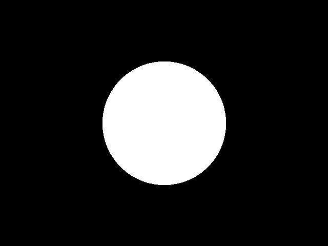
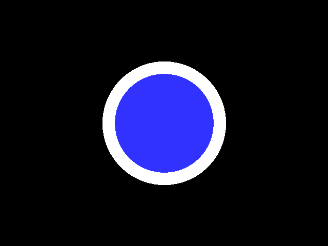
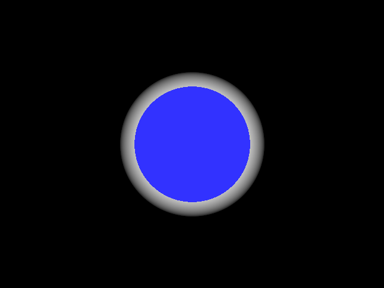
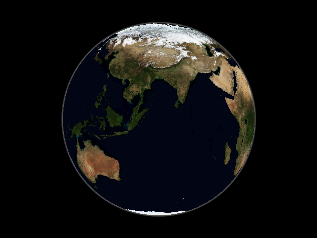
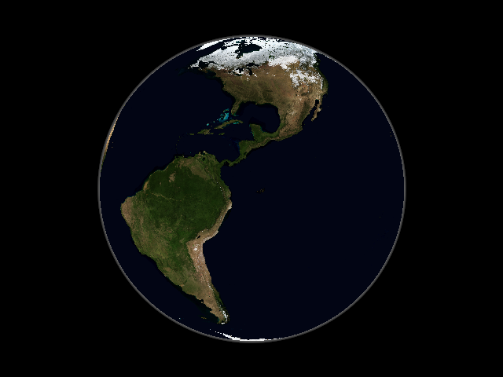
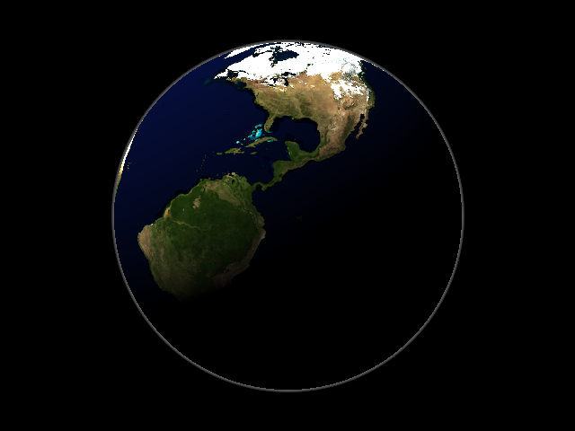
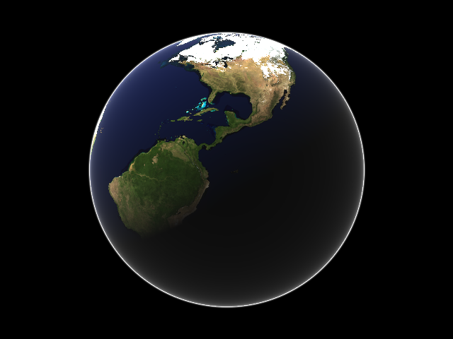

# Atmospheric Scattering

Work in progress

# Work log

Chronological

1. First useful output

2. White if the ray only hits the atmosphere, blue if it also hits in inner planet sphere

3. Atmosphere greyscale intensity is proportional to linear distance ray travels through atmosphere without striking planet, black = little distance, white = furthest distance

04. No big change but the Earth and atmosphere are now using real values from Wikipedia. Camera moved back to fit Earth in the image.

05. Rotate the Earth around it's vertical axis

06. Add directional sunlight (white light)

07. Visualize optical length

