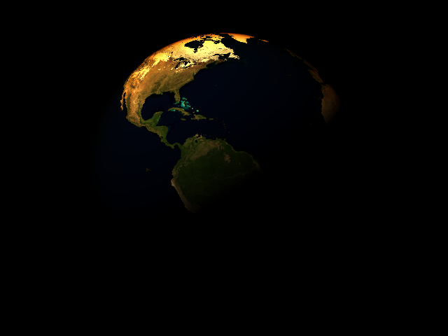
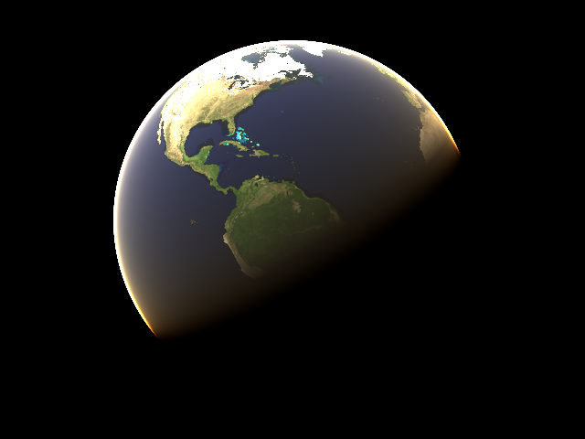

# Atmospheric Scattering

Work in progress

# Work log

Chronological

1. First useful output


2. White if the ray only hits the atmosphere, blue if it also hits in inner planet sphere


3. Atmosphere greyscale intensity is proportional to linear distance ray travels through atmosphere without striking planet, black = little distance, white = furthest distance


04. No big change but the Earth and atmosphere are now using real values from Wikipedia. Camera moved back to fit Earth in the image.


05. Rotate the Earth around it's vertical axis


06. Add directional sunlight (white light)


07. Visualize optical length


08. Rayleigh extinction term. Note how the extinction is wavelength dependent, red is absorbed the least, then green and finally blue. The absorption amount is proportional to optical length giving the ice cap the red tinge at the edge of the sphere because the light travels further and through thicker atmosphere (greater optical length).


09. Fixed a couple of flipped orientation bugs. Camera vertical axis was flipped but this wasn't visible because the UV coordinate system on the sphere was also flipped vertically and the planet was at Y=0. The UV coordinate system was also flipped horizontally which is visible (look at Continental US).



10. First plausible pass at Rayleigh in-scattering. It is using the wrong coefficients and has at least one simplification but it looks pretty.



# Notes

Despite many available sources on simulating atmospheric scattering, one of the challenges I have encountered has been cross referencing sources. Everyone has their own coefficients or alterations to equations.

### Extinction coefficients

I derived Rayleigh scattering extinction factors that match Hoffman and Preetham's using their wavelengths for Red, Green and Blue light

```
R, G, B = [650, 570, 475]nm = [650, 570, 475]*10e-9
R = ((8*pi^3(1.0003^2-1)^2)/(3*2.545e25*(650e-9)^4))*((6+3*0.035)/(6-7*0.035)) = 6.95265 * 10^-6
G = ((8*pi^3(1.0003^2-1)^2)/(3*2.545e25*(570e-9)^4))*((6+3*0.035)/(6-7*0.035)) = 1.17572 * 10^-5
B = ((8*pi^3(1.0003^2-1)^2)/(3*2.545e25*(475e-9)^4))*((6+3*0.035)/(6-7*0.035)) = 2.43797 * 10^-5
```

Blue wavelength at [Wolfram](https://www.wolframalpha.com/input/?i=((8*pi%5E3(1.0003%5E2-1)%5E2)%2F(3*2.545e25*(475e-9)%5E4))*((6%2B3*0.035)%2F(6-7*0.035)))

### Rayleigh scattering phase function

Nishita and O'Neil both use the Henyey-Greenstein phase function for scattering, equation 5 in the paper. If you set the asymmetry factor, g, to 0 then you get the `3/16π(1 + cos^2(theta))` equation from several papers (some of them did not include the `1/4π` normalization factor).

# References

* O'Neil [Accurate Atmospheric Scattering GPU Gems 2](https://developer.nvidia.com/gpugems/GPUGems2/gpugems2_chapter16.html)
* Preetham [A Practical Analytic Model for Daylight](https://www.cs.utah.edu/~shirley/papers/sunsky/sunsky.pdf)
* Nishita [Display of The Earth Taking into Account Atmospheric Scattering](http://nishitalab.org/user/nis/cdrom/sig93_nis.pdf)
* Bruneton [Precomputed Atmospheric Scattering](https://hal.inria.fr/inria-00288758/document)
* Bruneton published the [source code](https://github.com/ebruneton/precomputed_atmospheric_scattering) for an implementation of his paper
* http://glslsandbox.com/diff#40398.1-vs-40429.0
